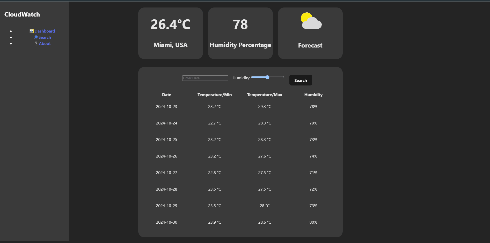

# Web Development Project 5 - CloudWatch

Submitted by: Juan Pirela

This web app: **Data can tell interesting stories. In this two-part project, you will create a data dashboard that provides an at-a-glance summary of information gathered from a public API. In part one, you choose a public API and construct the dashboard view of the project. The dashboard view contains summary statistics and a list view of the data that can be searched and filtered. The dashboard should tell an interesting story about the data and spark the user’s curiosity, inviting them to learn more.**

Time spent: **4** hours spent in total

## Required Features

The following **required** functionality is completed:

- [ X] **The list displays a list of data fetched using an API call**
- [ X] **Data uses the useEffect React hook and async/await syntax**
- [ X] **The app dashboard includes at least three summary statistics about the data such as**
  - [ DATE/MIN AND MAX TEMPERATURE/HUMIDITY] *insert details*
- [ X] **A search bar allows the user to search for an item in the fetched data**
- [ X] **Multiple different filters (2+) allow the user to filter items in the database by specified categories**

The following **optional** features are implemented:

- [ X] Multiple filters can be applied simultaneously
- [ X] Filters use different input types such as a text input, a selection, or a slider
- [ X] The user can enter specific bounds for filter values

The following **additional** features are implemented:

* [ ] List anything else that you added to improve the site's functionality!

## Video Walkthrough

Here's a walkthrough of implemented user stories:

